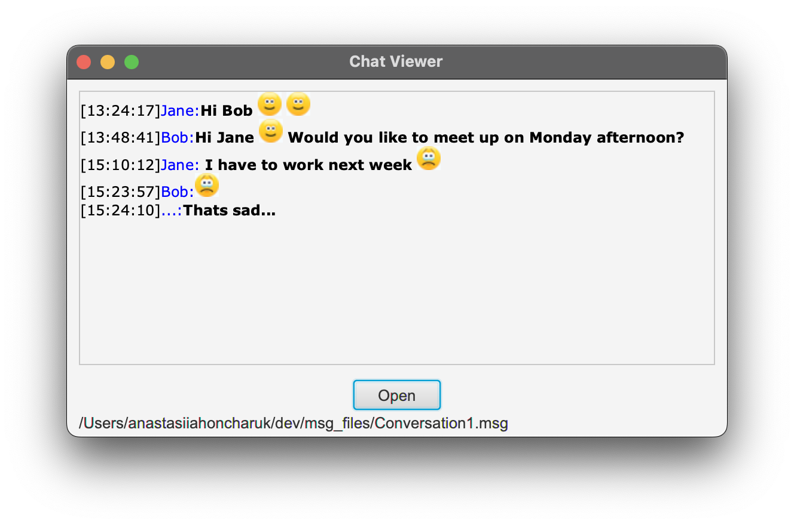

# Chat Viewer

## What is Chat Viewer?
ChatViewer is an application that can display a chat conversation which is stored in a file with a specific format.

## How to use Chat Viewer?
1. Open the ChatViewer application. 
2. Click on **Open** button.
3. In the dialogue window navigate to the directory where is the file with the conversation, select it and click **Open**.
4. In case that selected file has the correct format, the conversation is displayed.

